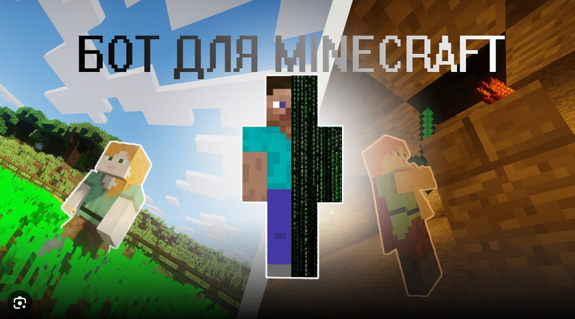

---
---

# Что умеет Python

---

*Python для **Telegram-ботов**: быстрые чат-боты на `aiogram`/`python-telegram-bot`, вебхуки через FastAPI/Flask, кнопки, меню, платежи, расписания.*

---

***Автоматизация в мессенджерах**: парсинг чатов, рассылки, интеграции с CRM/Google Sheets, диалоги с ИИ, модерация и формы.*

---

***Мультимодальные боты**: обработка текста, изображений и файлов; ответы по базе знаний, inline-клавиатуры, мини-приложения.*

---

***Игровые боты и скрипты**: управление персонажами и серверами, скрейпинг логов, автотесты модов, интеграция Discord/Telegram.*

---

***Веб-разработка**: сайты и API на FastAPI/Flask/Django, SSR с Jinja2/HTMX, авторизация, базы данных, фоновые задачи.*

---

***Веб-скрейпинг и сбор данных**: `requests`/`httpx`, `BeautifulSoup`/`lxml`, headless-браузеры, планировщики, антикапча.*

---

***Агрегация объявлений и цен**: мониторинг маркетплейсов, уведомления о снижении цены, выгрузка в CSV/Google Sheets/БД.*

---

***Машинное обучение и ИИ**: `numpy`, `pandas`, `scikit-learn`, PyTorch/TensorFlow; классификация, детекция, генерация медиа.*

---

***IoT и робототехника**: управление Arduino/ESP32 по UART/MQTT, обработка датчиков, телеметрия, компьютерное зрение на Raspberry Pi.*

---

***Геймдев на Pygame/Arcade**: 2D-игры, спрайты, звук, физика; обучение ООП и математики на игровых проектах.*
